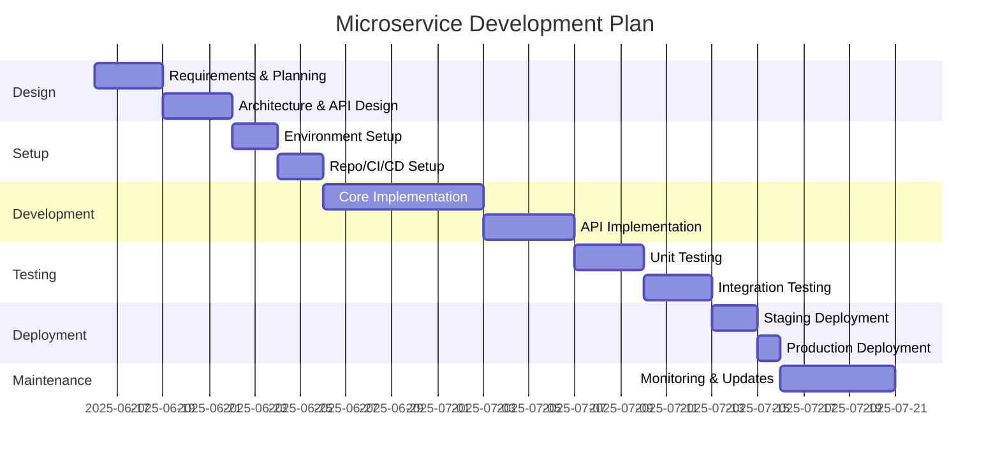

```mermaid
gantt
    title Microservice Development Plan
    dateFormat  YYYY-MM-DD
    section Design
    Requirements & Planning      :a1, 2025-06-16, 3d
    Architecture & API Design    :a2, after a1, 3d
    section Setup
    Environment Setup            :b1, after a2, 2d
    Repo/CI/CD Setup             :b2, after b1, 2d
    section Development
    Core Implementation          :c1, after b2, 7d
    API Implementation           :c2, after c1, 4d
    section Testing
    Unit Testing                 :d1, after c2, 3d
    Integration Testing          :d2, after d1, 3d
    section Deployment
    Staging Deployment           :e1, after d2, 2d
    Production Deployment        :e2, after e1, 1d
    section Maintenance
    Monitoring & Updates         :f1, after e2, 5d
```